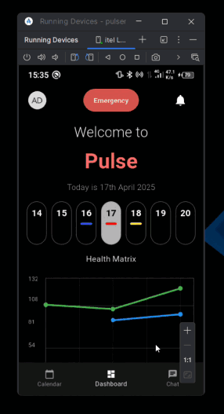

# Pulse Medical Application

A personal health management app that empowers users to monitor vital health metrics, manage medications, track clinic appointments, and interact with a smart assistant — all from their mobile device.



## Tech Stack

- **Flutter** – Cross-platform mobile app framework  
- **Firebase** – Authentication & Cloud Messaging  
- **Supabase** – Realtime database & API  
- **Gemini API** – Conversational health assistant  
- **LLarmaParse API** – Natural language understanding for health-related queries  

## Key Features

### Authentication
- Secure registration, login, and logout

### Conversational Assistant
- Ask about:
  - Health metrics trends (“Is my blood pressure normal?”)
  - Upcoming events (“What are my clinic schedules this week?”)
  - Medication purposes (“What is Metformin used for?”)
  - Reminder summaries (“What meds do I need to take today?”)

### Interactive Calendar
- Add:
  - Health logs (Sugar, Cholesterol, Blood Pressure)
  - Clinic schedules where wecan also update our reports.
  - Medication plans
- Color-coded categories:
- Tap any date to view what’s planned or required on that day

### Health Metrics Tracking
- Record and visualize **blood pressure**, **sugar levels**, and **cholesterol**
- View data on a **graphical dashboard**

### Smart Notification System
- Notifications for:
  - Clinic schedules appointments
  - Medication Reminders
 

## Getting Started / How to Use

### 0. Project Setup

```bash
# Clone the repository
git clone https://github.com/dilinamewan/pulsemedicalapplication.git
cd pulsemedicalapplication
```
Follow these steps to run the app locally:

### 1. Create Firebase Project

* Go to [Firebase Console](https://console.firebase.google.com/)
* Create a new project
* Enable **Authentication** and **database**
* Follow the setup guide for Firebase with Flutter:
  👉 [https://firebase.flutter.dev/docs/cli](https://firebase.flutter.dev/docs/cli)

### 2. Configure Supabase

* Go to [Supabase.io](https://supabase.io) and create a project
* Enable cloud storage for appoinment sheduling report storage.
* Get the **anon key** and **API URL**
  Replace them in `lib/main.dart` or wherever your Supabase client is initialized

### 3. Add Environment Variables

Create a `.env` file in the root of your Flutter project and add your keys:

```env
Gemini_API_KEY=your_gemini_api_key_here
Llama_Parse_API_KEY=your_llama_parse_key_here
```

Make sure you are using a package like `flutter_dotenv` to load these values.

### 4. Install Dependencies

Run the following in your project root:

```bash
flutter pub get
```

### 5. Run the App

Use:

```bash
flutter run
```

on your preferred emulator or physical device.

## Team Members
<div align="left">

<table style="table-layout: fixed; width: 100%;">
  <tr>
    <td align="center"></td>
    <td align="center"></td>
    <td align="center"></td>
    <td align="center"></td>
  </tr>
  <tr>
    <td align="center"><b>K.A.A.T Kulasooriya</b></td>
    <td align="center"><b>T.R.D.T. Dulshan</b></td>
    <td align="center"><b>H.P.G.D Mewan</b></td>
    <td align="center"><b>T.M Uduwana</b></td>
  </tr>
  <tr>
    <td align="center"><a href="https://github.com/Adhishtanaka">@Adhishtanaka</a></td>
    <td align="center"><a href="https://github.com/tdulshan3">@tdulshan3</a></td>
    <td align="center"><a href="https://github.com/dilinamewan">@dilinamewan</a></td>
    <td align="center"><a href="https://github.com/TanujMalinda">@TanujMalinda</a></td>
  </tr>

  <tr><td colspan="4"><br/></td></tr>

  <tr>
    <td align="center"></td>
    <td align="center"></td>
    <td align="center"></td>
    <td align="center"></td>
  </tr>
  <tr>
    <td align="center"><b>J.H.A.H Divyanjalee</b></td>
    <td align="center"><b>D.P.H.J Samarawickrama</b></td>
    <td align="center"><b>K.Rumesha Ishini Silva</b></td>
    <td align="center"><b>Kavindu Dilshan</b></td>
  </tr>
  <tr>
    <td align="center"><a href="https://github.com/Hirunidiv">@Hirunidiv</a></td>
    <td align="center"><a href="https://github.com/Janandie">@Janandie</a></td>
    <td align="center"><a href="https://github.com/krisilva">@krisilva</a></td>
    <td align="center"><a href="https://github.com/KDDilshan">@KDDilshan</a></td>
  </tr>
</table>

</div>


## Contributors  
If you find any bugs or want to suggest improvements, feel free to open an issue or pull request on the [GitHub repository](https://github.com/dilinamewan/pulsemedicalapplication/pulls).

